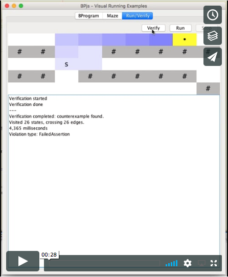
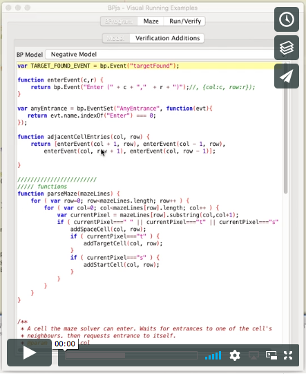

# Visual Examples

This project contains sample b-programs whose execution and verification an be
examined visually.

Currently, it provides a "playground" for running and verifying maze models.

This program may also serve as an example of using BPjs in a "normal" application.

## Screencaps

Running maze simulation:

Finding maze solution using verification:

---

* This project uses [BPjs](https://github.com/bThink-BGU/BPjs).
* BPjs uses the Mozilla Rhino Javascript engine. See [here](https://developer.mozilla.org/en-US/docs/Mozilla/Projects/Rhino) for project page and source code.
* Syntax coloring done using [RSyntaxTextArea](https://github.com/bobbylight/RSyntaxTextArea)
* The application UI is done using the standard Java Swing library.
